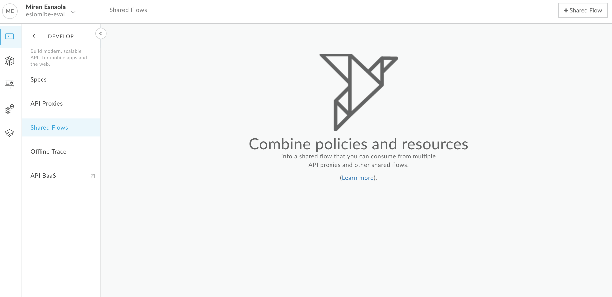
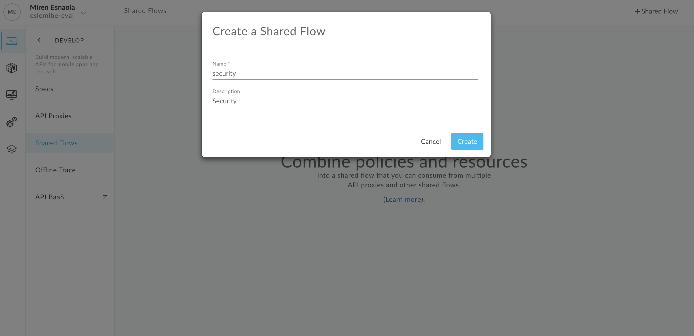
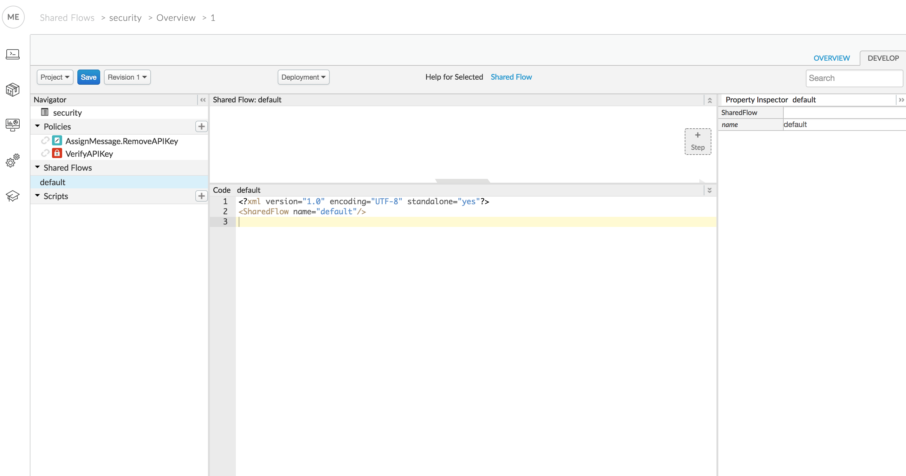
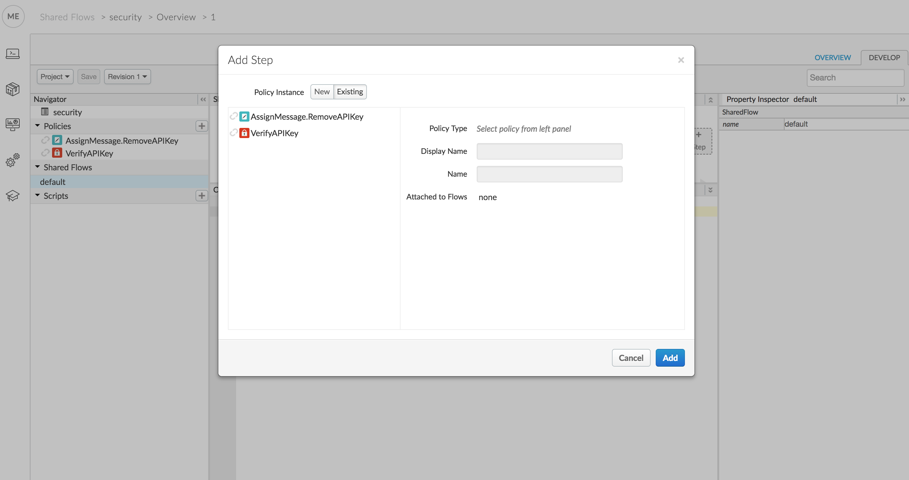

# Lab 05 - Shared Flows 

## Introduction

Objectives:

* Create a shared flow.
* Use the shared flow in an API proxy

## Instructions

We would like to have API security and traffic management features as the ones implemented for the API proxy in lab 4 in all our proxies. 

### Creating a shared flow

1. In the Apigee Edge UI go to **Develop > Shared Flows** and click on the **+Shared Flow** button to create a new shared flow.

    

2. Enter the name of the shared flow and a description

    

3. Once in the shared flow Overview page, click on the **DEVELOP** tab on the right.

4. Add a VerifyAPIKey policy with the following XML content:

        <?xml version="1.0" encoding="UTF-8" standalone="yes"?>
        <VerifyAPIKey async="false" continueOnError="false" enabled="true" name="VerifyAPIKey">
            <APIKey ref="request.queryparam.apikey"/>
        </VerifyAPIKey>

5. Add an AssignMessage policy with the following XML content:

        <?xml version="1.0" encoding="UTF-8" standalone="yes"?>
        <AssignMessage async="false" continueOnError="false" enabled="true" name="AssignMessage.RemoveAPIKey">
            <AssignTo createNew="false" transport="http" type="request"/>
            <Remove>
                <QueryParams>
                    <QueryParam name="apikey"/>
                </QueryParams>
            </Remove>
        </AssignMessage>

5. Having the "default" shared flow selected, click on the +Step button.

   

6. Select policy instance **Existing** and then click on the VerifyAPIKey policy.

   

7. Repeat the same step for the AssignMessage.RemoveAPIKey policy.

8. Click on **Save**.

9. Deploy to the test environment.

### Using the shared flow in an API proxy

We will take the proxy that we developed in lab 04 as a starting point and modify it to use the shared flow that we created in the previous section. Here are the steps.

1. Create a new FlowCallout policy with the following XML content:

        <?xml version="1.0" encoding="UTF-8" standalone="yes"?>
        <FlowCallout async="false" continueOnError="false" enabled="true" name="FlowCallout.Security">
            <SharedFlowBundle>security</SharedFlowBundle>
        </FlowCallout>

3. In the ProxyEndpoint replace the existing VerifyAPIKey and AssignMessage.RemoveAPIKey policy steps with a step for the FlowCallout policy that was created in the previous step, so the PreFlow looks as shown below:

        <PreFlow>
            <Request>
                <Step>
                    <Name>KeyValueMapOperations.ReadConfiguration</Name>
                </Step>
                <Step>
                    <Name>SpikeArrest</Name>
                    <Condition>environment.name = "prod"</Condition>
                </Step>
                <Step>
                    <Name>FlowCallout.Security</Name>
                </Step>
                <Step>
                    <Name>Quota</Name>
                    <Condition>environment.name = "prod"</Condition>
                </Step>
                <Step>
                    <Name>ResponseCache</Name>
                </Step>
            </Request>
            <Response/>
        </PreFlow>

4. Delete the VerifyAPIKey and AssignMessage.RemoveAPIKey policies from the proxy.

5. Save, change to the Trace tab and send the following request to check that everything is working fine:

    curl -v https://ORGANIZATION-ENVIRONMENT.apigee.net/book/v1/books?apikey=APIKEY

